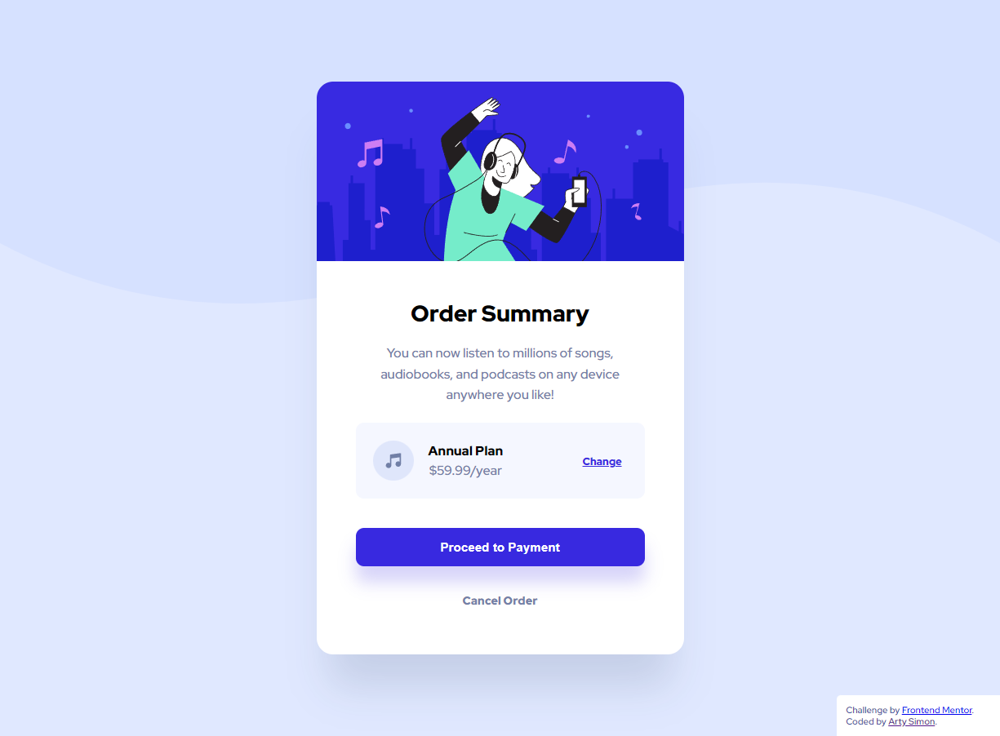

[](https://app.netlify.com/sites/artimys-order-summary-component/deploys)


# Frontend Mentor - Order summary card solution

This is a solution to the [Order summary card challenge on Frontend Mentor](https://www.frontendmentor.io/challenges/order-summary-component-QlPmajDUj). Frontend Mentor challenges help you improve your coding skills by building realistic projects.

## Table of contents

- [Overview](#overview)
  - [The challenge](#the-challenge)
  - [Screenshot](#screenshot)
  - [Links](#links)
- [My process](#my-process)
  - [Built with](#built-with)
  - [Continued development](#continued-development)
- [Author](#author)


## Overview

### The challenge

Users should be able to:

- See hover states for interactive elements

### Screenshot



### Links

- Solution URL: [https://github.com/artimys/order-summary-component](https://github.com/artimys/order-summary-component)
- Live Site URL: [https://artimys-order-summary-component.netlify.app](https://artimys-order-summary-component.netlify.app/)

## My process

### Built with

- npm / Gulp 4
```
# for local development:
# generate css file to _site and start browser sync,
# will auto open _site/index.html in browser at localhost:3000
#
gulp watch

# for netlify: auto generate css for deployment
#
gulp build
```
- Semantic HTML5 markup
- CSS custom properties
- Flexbox
- Mobile-first workflow

### Continued development

- Future to convert this to a React app

## Author

- Frontend Mentor - [@artimys](https://www.frontendmentor.io/profile/artimys)
